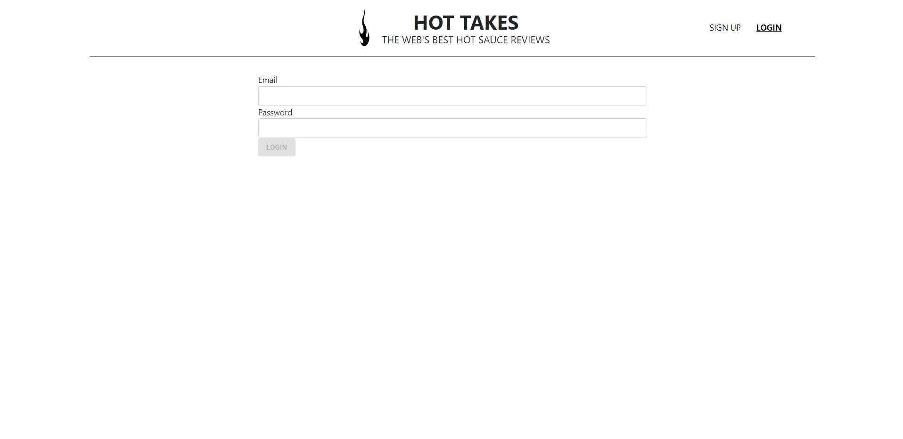
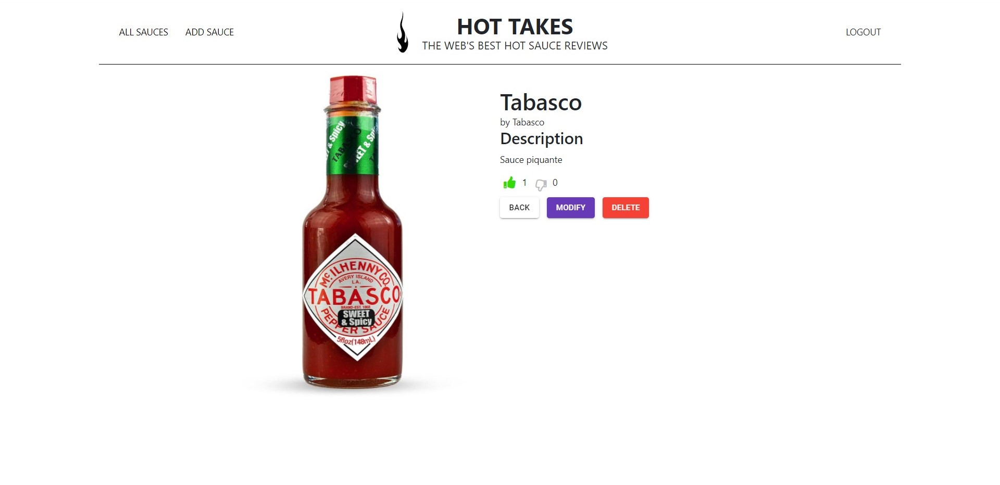

# Formation développeur web


## 📎 Projet 6 : Piiquante







## Technologies :
- Node.js
- Express
- Mongoose

## Base de données :
- MongoDB Atlas


## Installation :

Installer les dépendances dans chacuns des deux dossiers avec la commande `npm install`

### Frontend : 

Dans ce projet le frontend était fourni.\
Pour démarrer le serveur vous pouvez utiliser la commande `npm run start`\
Puis vous rendre sur `http://localhost:4200/`

### Backend :

A la racine du dossier back\
créer un répertoire `images`\
créer un fichier `.env` en précisant une valeur pour chaque variable comme suit :
```
USER_DB = '<Nom d'utilisateur mongoDB>'
PASSWORD_DB = '<Mot de passe mongoDB>'
PASSWORD_JWT = '<Clé secrète token>'
NAME_DATABASE = '<Nom base de donnée mongoDB>'
```
Démarrer ensuite le serveur avec la commande `node server` 

## Tester le projet :

```terminal
git clone https://github.com/Cyril-Develop/Piiquante.git
```
